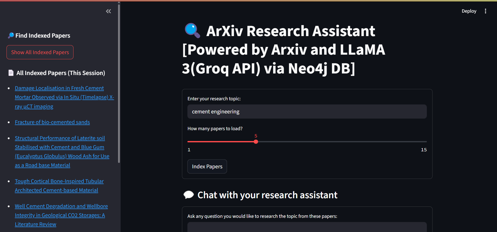
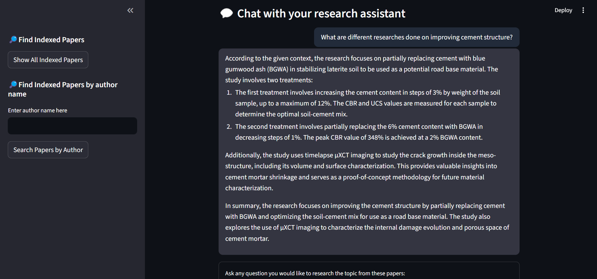

# 🔍 ArXiv Research Assistant

A Streamlit-based research assistant that leverages ArXiv papers and LLaMA 3 (via Groq API) for Retrieval-Augmented Generation (RAG) question answering, with graph-based paper/author exploration.

---

## Features

- **Fetch & index ArXiv papers** on any topic you choose.
- **Semantic search & Q&A**: Ask questions and get answers with sources from the indexed papers, powered by LLaMA 3 (Groq API).
- **Graph database (Neo4j) integration**: Stores metadata and relationships between papers, authors, and topics.
- - **Search indexed papers** by all or by author using the Neo4j graph database.
- **FAISS + Sentence Transformers** for fast vector search.
- **Streamlit UI**: Easy-to-use web interface.

---

## Demo



---
## Quickstart

### 1. Clone the repository

```bash
git clone https://github.com/yourusername/arxiv-research-assistant.git
cd arxiv-research-assistant
```

### 2. Install dependencies

It's recommended to use a virtual environment.

```bash
python -m venv venv
# On Windows:
.\venv\Scripts\activate
# On Mac/Linux:
source venv/bin/activate

pip install -r requirements.txt
```

### 3. Set up environment variables

Create a `.env` file in the project root with the following content:

```
GROQ_API_KEY=your_groq_api_key
GROQ_API_BASE=https://api.groq.com/openai/v1
GROQ_MODEL=llama3-8b-8192

NEO4J_URI=bolt://localhost:7687
NEO4J_USER=neo4j
NEO4J_PASSWORD=your_neo4j_password
```

- Replace `your_groq_api_key` with your Groq API key ([get one here](https://console.groq.com/)).
- Set Neo4j credentials as needed (see [Neo4j docs](https://neo4j.com/docs/)).

### 4. (Optional) Index ArXiv Papers

You can pre-index papers by running:

```bash
python index_papers.py
```

Or use the Streamlit UI to index on demand.

### 5. Run the Streamlit App

```bash
streamlit run app.py
```

Open the provided local URL in your browser.

---

## Usage

1. **Enter a research topic** and select the number of ArXiv papers to index.
2. **Ask questions** about the indexed papers.
3. **View answers and sources** directly in the app.
4. **Use the sidebar** to search for papers by author (using the Neo4j graph database).

---

## Requirements

- Python 3.9+
- [Groq API access](https://console.groq.com/)
- [Neo4j database](https://neo4j.com/) (local or remote)

---
## Acknowledgements

- [LangChain](https://github.com/langchain-ai/langchain)
- [FAISS](https://github.com/facebookresearch/faiss)
- [Sentence Transformers](https://www.sbert.net/)
- [Streamlit](https://streamlit.io/)
- [Groq](https://groq.com/)
- [ArXiv](https://arxiv.org/)
- [Neo4j](https://neo4j.com/)

---
## License

MIT License


